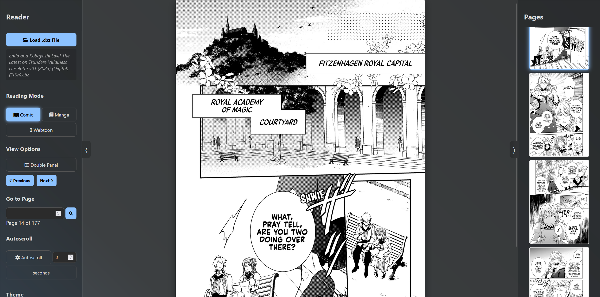

# CBZ Reader

A modern, feature-rich comic book reader for `.cbz` files, built with HTML, CSS, and JavaScript. This project uses Vite for a fast and efficient development experience.

## Screenshot



## Features

-   **Multiple Reading Modes:** Comic, Manga, and Webtoon modes to suit your reading style.
-   **Customizable Themes:** Choose from several themes to personalize your reading experience.
-   **Double-Panel View:** View two pages at once, perfect for comic book spreads.
-   **Thumbnail Navigation:** Quickly jump to any page using the thumbnail sidebar.
-   **Keyboard Shortcuts:** Navigate through your comics with ease using keyboard shortcuts.
-   **Autoscroll:** Automatically scroll through pages at a customizable interval.
-   **Last Read:** The application remembers the last comic you were reading and the page you were on.

## Keyboard Shortcuts

| Key(s)          | Action                            | Notes                                        |
| --------------- | --------------------------------- | -------------------------------------------- |
| `ArrowUp` / `W`     | Scroll Up                         |                                              |
| `ArrowDown` / `S`   | Scroll Down                       |                                              |
| `ArrowLeft` / `A`   | Previous Page                     | In Manga mode, this becomes the "Next Page". |
| `ArrowRight` / `D`  | Next Page                         | In Manga mode, this becomes the "Previous Page". |

## Getting Started

### Prerequisites

-   [Node.js](https://nodejs.org/) (which includes npm) must be installed on your system.

### Installation & Running

1.  **Clone the repository:**
    ```bash
    git clone https://github.com/BilegjargalN/cbz-reader.git
    cd cbz-reader
    ```

2.  **Install dependencies:**
    ```bash
    npm install
    ```

3.  **Start the development server:**
    ```bash
    npm run dev
    ```

    This will start a local server. Open your browser and navigate to the URL provided (usually `http://localhost:5173`).

4.  **Build for production:**
    ```bash
    npm run build
    ```
    This will create a `dist` folder with the optimized, production-ready files.

## How to Use

1.  Click on the "Load .cbz File" button to select a comic book file from your computer.
2.  Use the controls in the sidebar to change the reading mode, theme, and other settings.
3.  Enjoy reading your comic!
